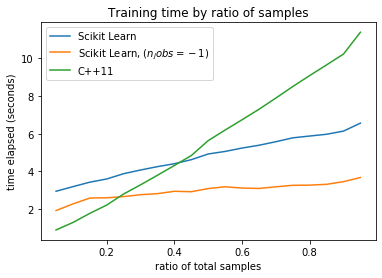
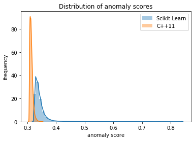

## Overview

A simple C++11 header-only library implementing the Isolation Forest algorithm. The goal of this project was to help me gain a more intuitive understanding of the algorithm, while learning C++ in the process.

For use of the library, please refer to the following example.

```C++
#include "isolationforest.hh"
#include <vector>
#include <memory>

using namespace isolationforest;

int main() {
    // Populate samples
    SamplePtrVector samples;

    SamplePtr s1 = std::make_shared<Sample>();
    SamplePtr s2 = std::make_shared<Sample>();
    SamplePtr s3 = std::make_shared<Sample>();

    std::vector<double> data1 = {0.17, 0.29, 0.42, 0.2};
    std::vector<double> data2 = {0.3, 0.2, 0.12, 0.32};
    std::vector<double> data3 = {0.8, 0.1, 0.2, 0.98};

    s1->index = 1;
    s2->index = 2;
    s3->index = 3;

    s1->data = data1;
    s2->data = data2;
    s3->data = data3;

    samples.push_back(s1);
    samples.push_back(s2);
    samples.push_back(s3);

    // initialize parameters
    int depth = std::ceil(std::log2(samples.size()));
    int nfeatures = (unsigned int) (*samples.begin())->data.size();
    int nestimators = 100;
    float subsampling_rate = 0.9;

    // intialize the isolation forest
    Forest f = Forest(depth, nfeatures, nestimators, subsampling_rate);

    // Fit the isolation forest
    f.createForest(samples);

    // Score the samples
    std::map<int, double> scores = f.scoreSamples(samples);
}
```


## Analysis of the Library

For the analysis, I will be comparing the implementation in this project to that of Sci-kit Learn [1]. The algorithm in this project is implemented as proposed in the original paper [2]. The dataset used is the `Credit Card Fraud Detection` dataset available on Kaggle [3].

#### Speed and Scalability


When analyzing the training execution time of the two libraries, the C++11 library outperforms Scikit Learn when the number of subsamples is relatively low, but is slower as the number of subsamples nears 50% of the total sample group. When training the models using 256 samples as reccomended in the original article, the C++11 library ran in an average of `0.5563` seconds while Scikit Learn ran in an average of `2.3577` seconds after `100` runs. Overall, Scikit Learn is still significantly more scalable. It should be noted that these results are not consistent across machines. My 2013 Macbook shows significantly worse results for the C++ code.


### Performance of model


The image above shows the distributions of the anomaly scores for both libraries. It quite clear that the scores created by the scikit-learn library boasts more variety. 

## Future Work
Although I have no immediate future plans for this project, as my familiarity with C++ develops, I may improve on the design and performance of the library.


## References
[1] https://scikit-learn.org/stable/modules/generated/sklearn.ensemble.IsolationForest.html<br>
[2] https://cs.nju.edu.cn/zhouzh/zhouzh.files/publication/icdm08b.pdf?q=isolation-forest<br>
[3] https://www.kaggle.com/mlg-ulb/creditcardfraud <br>